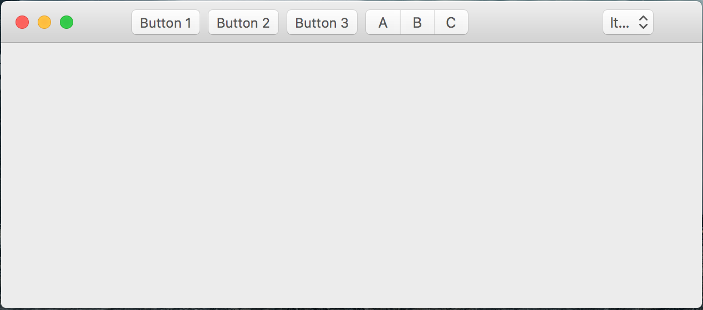

# QtMacExtras

Few quick notes:

 - It's work-in-progress
 - Low-priority project
 - MIT license
 - OS X 10.11+, Qt 5.7+ (didn't bother to check other versions, but should be okay)
 
## Features

 - System provided icons 
 - New toolbar look with widgets
 - Many more to come (someday)
 
## Requirements
 - XCode and Qt of course!

## Example
 - Bundled and shipped with source, look at ```main.cpp``` 

## Contributions
 - Post your ideas into Issues page or use PRs.
 
 